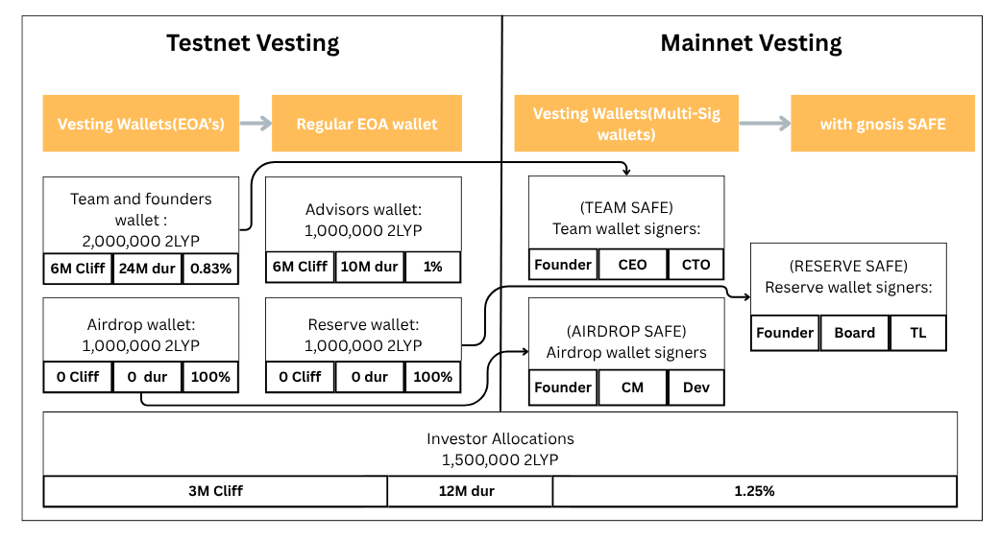

# 2LYP Tokenomics

Welcome to the official repository for the **2LYP Token** — a deflationary utility token designed to power the 2LYP decentralized ecosystem.

This repository documents the economic design and technical structure of the 2LYP Token:

- 📄 Tokenomics report in LaTeX and PDF format  
- 💡 Visual graphs for vesting schedules and burn mechanisms  
- 🔐 Secure and well-documented ERC20 smart contract  
- 📦 Airdrop, faucet, and burn mechanisms  
- 🛡️ Access control mechanisms built in

## 🧾 Token Overview

| Property           | Value                                             |
|--------------------|---------------------------------------------------|
| **Token Name**     | 2LYP Token                                        |
| **Symbol**         | 2LYP                                              |
| **Total Supply**   | 10,000,000 (10 Million)                           |
| **Initial Supply** | 500,000 (5%)                                      |
| **Max Supply**     | 10,000,000 (Capped)                               |
| **Decimals**       | 18                                                |
| **Type**           | ERC20 (custom)                                    |
| **Network**        | Polygon Amoy Testnet                              |
| **Burn Rate**      | 1% Quarterly deflation + 2% on transfer (default) |

## 📉 Token Distribution

- **Team & Founders**: 20% (2,000,000 tokens)
- **Advisors**: 10% (1,000,000 tokens)
- **Investors**: 15% (1,500,000 tokens)
- **Community & Ecosystem**: 45% (4,500,000 tokens)
  - Airdrops: 10%
  - Liquidity Mining & Staking: 20%
  - Community Rewards & Incentives: 7.5%
  - Ecosystem Development: 7.5%
- **Reserve Fund**: 10% (1,000,000 tokens)

## 📆 Vesting Schedules

Team, advisors, and investors follow structured vesting schedules with cliffs and monthly releases.

### Team Vesting
- **Total**: 20% (2,000,000 tokens)
- **Cliff**: 6 months
- **Vesting Period**: 24 months  
- **Monthly Release**: ~83,333 tokens/month

### Advisors Vesting
- **Total**: 10% (1,000,000 tokens)
- **Cliff**: 6 months  
- **Vesting Period**: 10 months  
- **Monthly Release**: 100,000 tokens/month

### Investors Vesting
- **Total**: 15% (1,500,000 tokens)
- **Cliff**: 3 months  
- **Vesting Period**: 12 months  
- **Monthly Release**: 125,000 tokens/month

> 📊 See vesting visuals in [`2LYP-Tokenomics.pdf`](./2LYP-Tokenomics.pdf)

## Deflationary Model

- 🔁 **Quarterly Burn**: 1% of the total supply burned every 3 months
- 🔥 **Transfer Burn**: 2% of each transaction is burned (default, configurable)
- 🔍 Transparent and auditable on-chain
- 📉 Results in decreasing supply over time → increased scarcity

## 🎁 Airdrop

- Total Allocation: **10%** (1,000,000 tokens)
- Distributed over multiple rounds
- Eligibility based on early participation and project-defined criteria

## 🛠 Smart Contract
The 2LYP Token is implemented as an advanced ERC20 smart contract with added deflationary mechanics, faucet minting, vesting schedules, and airdrop logic. It is built on top of OpenZeppelin’s secure libraries.

**Key Features:**

- **Quarterly Deflation**

    Manually trigger a 1% burn every 90 days via `triggerQuarterlyBurn()`.

- **Ownership & Supply Cap**

    Only the owner can mint tokens, up to the defined `MAX_SUPPLY`.

- **Faucet Minting**

    Users can claim fixed test tokens at intervals via `faucetMint()`, with cooldown and drip settings adjustable by the owner.

- **Airdrop Claim System**

    Owner can set eligible users and token amounts; users claim via `claimAirdrop()`.

- **Vesting Logic**

    Owner sets custom vesting schedules per user, with cliffs and durations. Users call `releaseVestedTokens()` to unlock vested tokens.

- **Token Rescue Mechanism**

    Owner can recover wrongly sent ERC20 tokens (excluding this token) via `rescueERC20()`.

## Full Tokenomics

Refer to [`2LYP-Tokenomics.pdf`](./2LYP-Tokenomics.pdf) for:

- Full supply details  
- Allocation rationale  
- Vesting models  
- Deflationary graph  
- Governance plans  
- Utility use cases

## License

This project is licensed under the **MIT License**.

##  Authors

Developed and maintained by **2LYP Computations**
